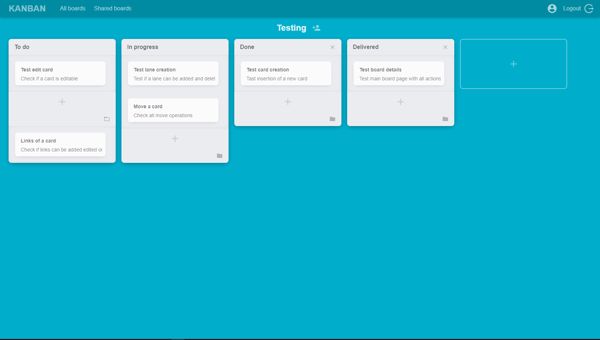

# Project: "Kanban Board"
## Student: Klaus Cuko 

## React client application routes

- Route `/`: No page, is a redirect for `/all-boards` in case of authenticated user instead redirect to `/trial-board`.
- Route `/all-boards`: Is the main logged page, that show all boards of the user (owned and shared).
- Route `/shared-boards`: List of boards shared by the user and with the user.
- Route `/board/:id`: Board page, when the user can interact with a single board. The params `:id` is the board identifier for asking to the sever it details.
- Route `/trial-board`: Example board page, for display a read-only (static) board visible to all user (also unauthenticated)

## REST API server

All API are under the path `/api/v1`

- POST `/login`
  - Request: `{"username":"klaus.cuko","password":"password"}`
  - Response: `{"id":1,"name":"Klaus","surname":"Cuko","username":"klaus.cuko","email":"klaus.cuko@gmail.com"}`
- POST `/logout`
  - Request: `{}`
  - Response: `{"msg":"logged out"}`
### Board API
- GET `/boards/:boardId`
  - No request body
  - Response: `{"id":115,"userId":1,"title":"Board 4","lanes":[{"id":205,"boardId":115,"title":"To do","position":0,"cards":[]},{"id":206,"boardId":115,"title":"Done","position":1,"cards":[]}]}`
- POST `/boards`
  - Request: `{"title":"boards","userId":1}`
  - Response: `{"id":118}`
- POST `/boards/:boardId/users`
  - Request: `{"username":"giuseppe.verdi"}`
  - No response body
- DELETE `/boards/:boardId`
  - No request body
  - No response body
### Lane API
- GET `/lanes/:laneId/cards?status`
  - No request body
  - Query String `status` can be Active or NonActive
  - Response: `[{"id":43,"laneId":150,"title":"Static app","position":0,"status":"Active","description":"Implement an example board static\n"}]`
- POST `/lanes`
  - Request: `{"laneId":112,"position":3,"title":"Done"}`
  - Response: `{"id":214}`
- PUT `/lanes/:laneId`
  - Request: `{"title":"In progress"}`
  - No response body
- DELETE `/lanes/:laneId`
  - No request body
  - No response body

### Card API
- GET `/cards/:cardId`
  - No request body
  - Response: `{"id":43,"laneId":150,"title":"Static app","position":0,"status":"Active","description":"Implement an example board static\n","links":[]}`
- POST `/cards`
  - Request: `{"laneId":150,"position":1,"title":"First card","description":"Test","deadline":"2020-07-19","status":"Active"}`
  - Response: `{"id":54}`
- PUT `/cards/:cardId`
  - Request: `{"laneId":151,"title":"First card","position":1,"status":"Active","description":"Test","deadline":"2020-07-19"}`
  - No response body
- DELETE `/cards/:cardId`
  - No request body
  - No response body

### Link API
- POST `/links`
  - Request: `{"value":"Test","cardId":43}`
  - Response: `{"id":2}`
- PUT `/links/:linkId`
  - Request: `{"cardId":43,"value":"Link"}`
  - No response body
- DELETE `/links/:linkId`
  - No request body
  - No response body

## Server database
- Table `Board` - Contains all boards with auto-generated id, userId is used as foreign key
- Table `Lane` - Contains all lanes with auto-generated id, boardId is used as foreign key
- Table `Card` - Contains all cards with auto-generated id, laneId is used as foreign key
- Table `Link` - Contains all links with auto-generated id, cardId is used as foreign key
- Table `User` - Contains all users with auto-generated id
- Table `SharedBoards` - Contains all relationship between users and boards, boardId and userId are used as primary keys

Trigger are used for manage boards, lanes and cards deletion on cascade and for updating position in case of lanes and cards delete operation.

## Main React Components

- `ListBoards` (in `ListBoards.js`): Component that is used for list boards for both section (all boards and shared boards)
- `WorkBoard` (in `WorkBoard.js`): Component used for manage board (trial-board or generic board)
- `Board` (in `Board.js`): Component used for handle all board operation and showing all board information
- `Lane` (in `Lane.js`): Component used for handle all lane operation and showing all lane information
- `Card` (in `Card.js`): Component used for handle all card in lane operation (move, delete, archive, unarchive) and showing all card information
- `CardModalForm` (in `CardModalForm.js`): Component used for handle all card operation (edit, archive, create, delete)
- `CardModalInfo` (in `CardModalInfo.js`): Component used for showing all card information and perform links operations
- `LoginModal` (in `LoginModal.js`): Component used for handle user authentication
- `ShareModal` (in `ShareModal.js`): Component used for sharing boards with other user
- `Navigator` (in `Navigator.js`): Component used for manage app routing
- `StateProvider` (in `StateProvider.js`): Component used for manage app context

All files inside a `state` in each component folder contains action, effect and reducer for that component. The design of app state is similar to Redux pattern.

## Screenshot

## Test users

* klaus.cuko, password (frequent customer)
* ma.rossi, password
* giuseppe.verdi, password (frequent customer)
* lu.blu, password
* andrea.grigio, password
