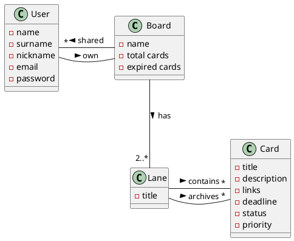

# Kanban Board

Author: Klaus Cuko
StudentID: S260351
Version: 0.1

# Content

# Functional requirements
| ID | Description |
| - | - |
| FR1 | User management |
| FR1.1 | User sign up |
| FR1.2 | User sign in/out |
| FR1.3 | List board that user has shared |
| FR1.4 | List board shared with the user |
| FR2 | Board management |
| FR2.1 | CRUD Board |
| FR2.2 | Add/Remove lane |
| FR2.3 | Add/Remove shared board with |
| FR2.4 | CRUD Lane |
| FR2.5 | CRUD Card |
| FR2.6 | Archive/Unarchive Card |
| FR2.7 | Move card between lanes |

# Glossary

